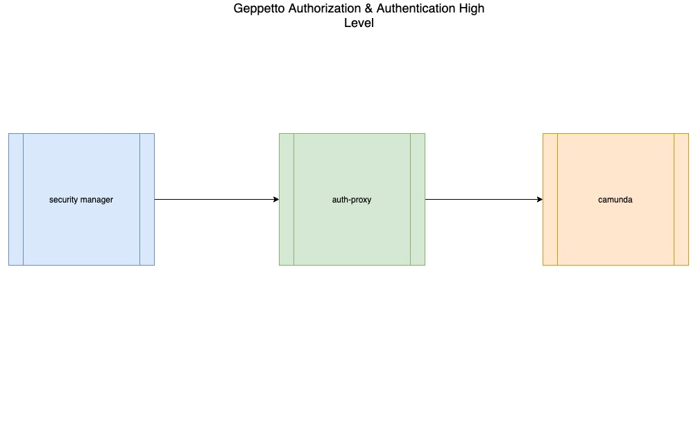

# High level design for Geppetto Authentication and Authorization

## The main components 

1. Security Manager - handles authentication and JWT management
2. Authorization Proxy - handles authorization integration to Rules process
3. Camunda DMN Engine - performs the logic for authorization

## Security Manager

## Authorization Proxy

## Camunda DMN

## Authorization Manager in Generated applications

- [] what are the components involved? should they be in the Generator docs?
- lets create a context diagram of the components

### Getting started docs

-First Download the camunda
-To run the command in the terminal

./camunda-modeler

REFERENCE

https://docs.camunda.org/manual/7.15/reference/rest/

 

Dmn in the cloud

https://dmn.lab.camunda.com/

https://dmn.lab.camunda.com/examples/index.html

Start and setup

https://docs.camunda.org/manual/latest/user-guide/dmn-engine/

https://docs.camunda.org/get-started/dmn/

postman

https://docs.camunda.org/manual/7.15/reference/rest/decision-definition/post-evaluate/

