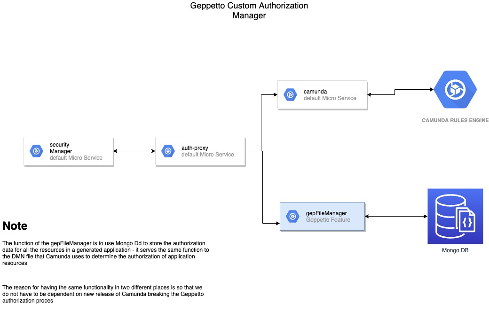

# Geppetto Custom Authorization Manager

The purpose of the Geppetto Custom Authorization Manager, henceforth **GCAM** is to save the authorization level for all UI, API, Entities, and Enity Fields in a Geppetto generated application

The **GCAM** serves the same purpose as the Camunda Microservice and the DMN file

## Why do it twice

Why do we have the **GCAM** and the Camunda MS/DMN file? The reason is that the **GCAM** is much simpler (json/node/mongo) then the Camunda/DMN combination

The diagram below show the relationship of the **GCAM** and the original Authentication and Authorization used in Geppetto

The sample json the is used as the basis for the collection in Mongo DB can be seen [SAMPLE JSON](./sample-authorization.json)