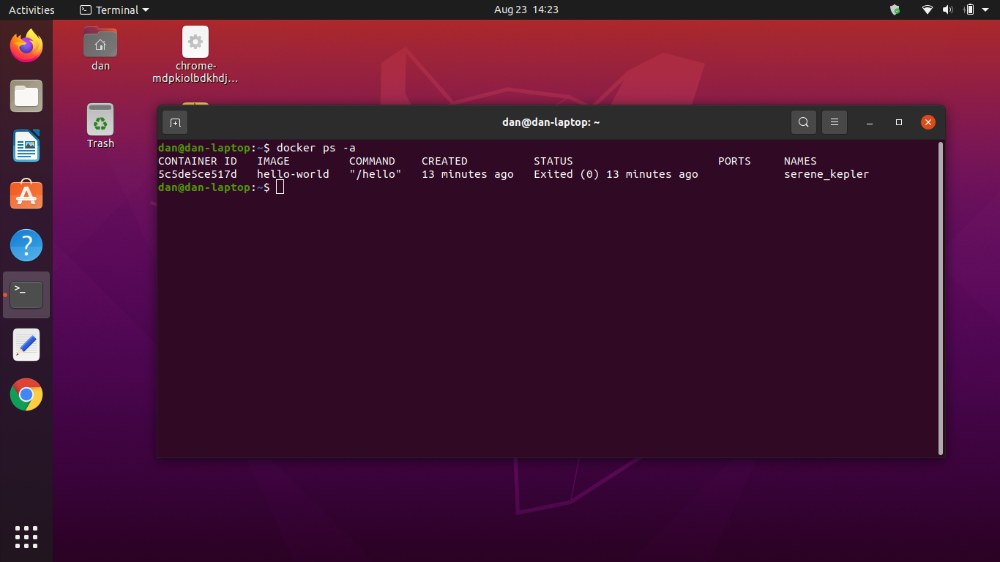

# Getting Started

## Local Installation

## Pre requisites

The Geppetto application requires the following:

| Component        | Type/Version                      |
| -------------    | :-----------:                     |
| Computer Memory  | 16 GB                             |
| Computer OS      | Ubuntu 20.x/Mac 11.5.x            |
| Git              | 2.30.x (or latest)                |
| Github           | sign up on web                    |
| Docker           | 20.10.x                           |
| Docker-compose   | 1.29.x                            |
| NVM              | latest version for github         |
| Node             | 14.15.x                           |
| NPM              | 7.20.x                            |
| Angular-cli      | 12.1.3                            |
| VS Code          | July 2021 (version 1.59) or above |

---
&nbsp;
&nbsp;

## Step by Step Installation

&nbsp;
&nbsp;

### Step one

- Git
  - [Install Git on Ubuntu](https://linuxconfig.org/how-to-install-git-on-ubuntu-20-04-lts-focal-fossa-linux)

### Step two

- Github 
  - [Sign up](https://github.com/)

### Step three

- Docker
  - [How to Install Docker On Ubuntu 20.04 LTS Focal Fossa](https://www.youtube.com/watch?v=aMKUuaga85A)
    1. once docker is installed execute this command: $~~$ ***sudo usermod -aG docker $USER***
    2. close all apps including the terminal
    3. shutdown the machine
    4. restart the machine and open a terminal issue this command: $~~~$ ***docker ps -a***
    5. if your screen looks like the image below docker is successfully installed on your machine 
    
  - [Official Docker Documentation](https://docs.docker.com/engine/install/ubuntu/)

### Step four

- NVM
  - [Installing NVM](https://github.com/nvm-sh/nvm#install--update-script)

### Step five

- Node
  - [Install via NVM](https://github.com/nvm-sh/nvm#usage)

### Step xxx

- Clone from Github:
&nbsp;

***Command:***$~$ ***git clone*** $~$ https://github.com/dan-castillo/geppettotest.git

## Testing local installation - Create and Generate and Application