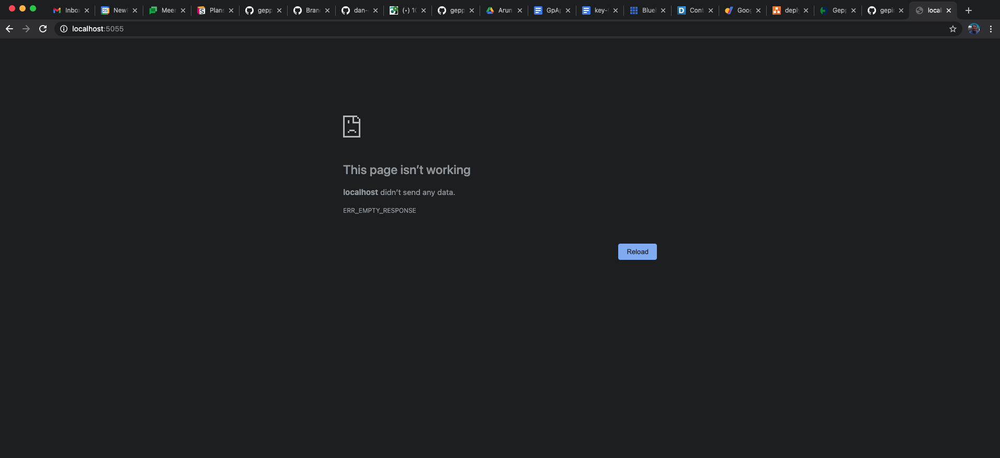

# Notes on Ticket application

The purpose of this file is to keep a running history of the generation of the Ticketing application

## Initial Generation - date Jan 25th

The initial attempt generated into Git compiled with out errors but when I hit the URL: <http://localhost:5055> I received the error shown in the picture below

### error screen

## Bug explanation and discussion

Jp was able to track down issues that created the screen shot above

1. the Angular app did not compile because a screen was generated that was NOT bound to an Entity the screen in question was the "createSeverity" screen

2. the labels for the create ticket screen were not generated although this did not create the angular compile issue - this issue is tracked under #805

3. Need to fix Secondary Entity issue - although this did not cause an error with out it we can not have dropdowns on the createTicket screen that permits the user to give the ticket a severity (aka "high", "medium", "low") or assign a service.

### Geppetto project information

- Project Name: testticketone
- [Github generated project](https://github.com/gepinfo/testticketone_3611.git) 
- Three features
  - severitymaintenance - only used by admins to add lists of severities to system
  - servicetypemaintenance - only used by admin to add lists of services/ticket types that can be added to the system
  - ticketing - this can be seen be any one using the system, this is how tickets are created

### The ticket feature

  since as of this first generation we have a bug with Primary and Secondary entities I create all of the features to only use Primary entities - this means that for this first version/attempt the create Ticket screen does not have dropdowns

### Team todo

1. using the generated code identify why the app did not run on local

---

2. using Camunda/Guards only show the routes for the severitymaintenance and the servicetypemaintenance to Admins . In other words only Admins can see/select these feature from the application menu
  
Update: since JP fixed the angular compile issue (task #805) Mithun can now take the first gen code and starts to use us it for his authorization work

---

3. deployed application to either Fargate or EC2

4. what ever fixes were done to get the app running needs to be applied to the Geppetto generator and the application generated again to see if the fixes solved the issue
